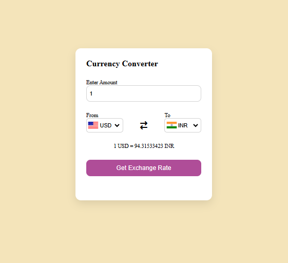

# 💱 Premium Real-Time Currency Converter Engine

Welcome to the production-ready **Currency Converter** web utility hub. This project is engineered utilizing premium vanilla frontend styling paradigms combined with a strictly modular JavaScript framework to deliver an elegant, pixel-perfect financial calculation interface.

Designed with an ultra-clean user experience, this repository showcases advanced form handling, data separation structures, and fluent calculations without relying on heavy frontend frameworks.

---

## 🤵 Repository Host Details

- **Author Name:** amir
- **GitHub Profile Alias:** [amirsohail100](https://github.com/amirsohail100)
- **Official Communication Endpoints:** amirsoahil10@gmail.com
- **Project Status:** Production Ready & Operational 🟢

---

## 📸 Live Preview of the Interface



---

## 🛠️ Core Features & Engineering Objectives (Final UI)

- **Continuous Dense Money Rain:** Engineered 24 floating currency symbols ($ , ₹, €, £, ¥, 💵, ₿) using staggered negative animation delays to guarantee smooth, infinite falling loops with zero delay gaps on load.
- **Frosted Glassmorphism Transparency:** Configured translucency (`rgba`) and backdrop blur filter (`blur(22px)`) on the main converter card, allowing falling background currencies to blur gracefully behind the card interface.
- **Custom Modern Dropdowns:** Replaced default browser select menus with a sleek custom UI containing custom chevrons, theme-adaptive dark/light option menus, and custom scrollbars.
- **Dynamic Theme Switcher:** Fully supports Dark and Light themes with adaptive emerald green high-visibility CSS color variables.
- **Database & Logic Decoupling:** Separated static indices database (`app.js`) from live conversion procedures (`code.js`) for modular scalability.

---

## 📂 Modular File Architecture Breakdown

To enforce enterprise-grade clean coding structures (Separation of Concerns), the application space is organized cleanly into four central files:

| File Name           | Structural Layer     | Technical Responsibility                                                                   |
| :------------------ | :------------------- | :----------------------------------------------------------------------------------------- |
| 🌐 **`index.html`** | Structural Blueprint | Hosts semantic input fields, theme switcher, money rain layers, and dynamic card wrappers. |
| 🎨 **`style.css`**  | Visual Presentation  | Manages glassmorphism blur, dropdown styling, custom scrollbars, and keyframe animations.  |
| ⚡ **`app.js`**     | Local Database Array | Contains the entire data index of global currencies and validation mappings.               |
| 🧠 **`code.js`**    | Core Logical Engine  | Intercepts user inputs, calls evaluation arrays, and renders live values to DOM nodes.     |

---

## 💻 Tech Stack Components

- **Markup Layer:** HTML5 Semantic Form Structure Elements
- **Visual Engine:** Custom CSS3 (Flexbox, Glassmorphism Backdrop Blur, Swaying Currency Trajectories)
- **Execution Logic:** ES6+ JavaScript Script Pipelines (Modular Mapping, Real-time DOM Updates)

---

## 🚀 How to Launch the Interface Locally

Follow these basic guidelines to spin up the workspace instantly on your target machine:

### 1. Clone the Target Workspace

```bash
git clone [https://github.com/amirsohail100/Currency-Converter.git](https://github.com/amirsohail100/Currency-Converter.git)
cd Currency-Converter
```
